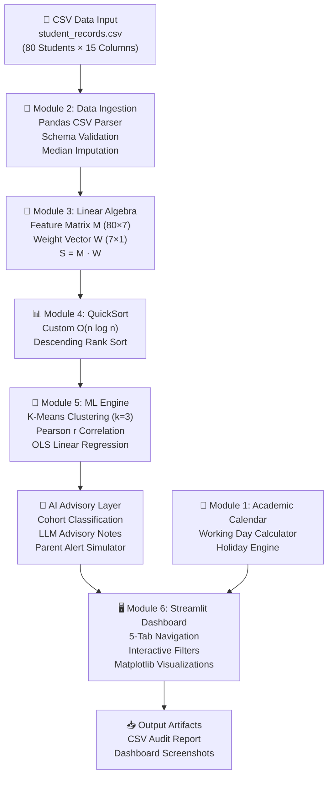
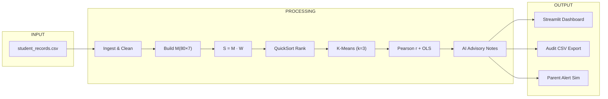
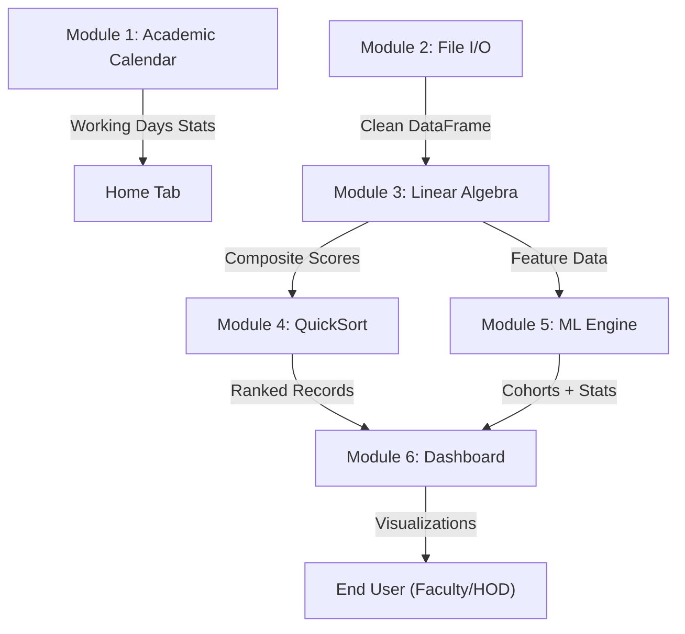

# 📄 PROJECT DOCUMENTATION
## Project 17: Smart Attendance & Performance Analyzer
### JNTUK R23 Curriculum — B.Tech Artificial Intelligence & Data Science (1st Year, 2025 Batch)

---

## Table of Contents

1. [Project Title & General Information](#1-project-title--general-information)
2. [Abstract](#2-abstract)
3. [Introduction & Problem Statement](#3-introduction--problem-statement)
4. [Objectives of the Project](#4-objectives-of-the-project)
5. [Scope of the Project](#5-scope-of-the-project)
6. [Curriculum Mapping & Syllabus Integration](#6-curriculum-mapping--syllabus-integration)
7. [System Architecture & Design](#7-system-architecture--design)
8. [Technology Stack & Tools Used](#8-technology-stack--tools-used)
9. [Dataset Description](#9-dataset-description)
10. [Module-Wise Detailed Explanation](#10-module-wise-detailed-explanation)
    - [Module 1: Academic Calendar & Timetable Tracking Engine](#module-1-academic-calendar--timetable-tracking-engine)
    - [Module 2: File I/O & Data Ingestion](#module-2-file-io--data-ingestion)
    - [Module 3: Linear Algebra — Matrix Transformation & Weighted Scoring](#module-3-linear-algebra--matrix-transformation--weighted-scoring)
    - [Module 4: Data Structures — QuickSort Algorithm](#module-4-data-structures--quicksort-algorithm)
    - [Module 5: Machine Learning & Advanced Feature Engines](#module-5-machine-learning--advanced-feature-engines)
    - [Module 6: Streamlit Interactive Web Dashboard](#module-6-streamlit-interactive-web-dashboard)
11. [Mathematical Formulations](#11-mathematical-formulations)
12. [Advanced Features](#12-advanced-features)
13. [Project Directory Structure](#13-project-directory-structure)
14. [Source Code Explanation](#14-source-code-explanation)
15. [Input & Output Specifications](#15-input--output-specifications)
16. [Sample Output & Dashboard Screenshots](#16-sample-output--dashboard-screenshots)
17. [AI & Prompt Engineering Layer](#17-ai--prompt-engineering-layer)
18. [Testing & Verification](#18-testing--verification)
19. [How to Run the Project](#19-how-to-run-the-project)
20. [Limitations & Future Enhancements](#20-limitations--future-enhancements)
21. [Conclusion](#21-conclusion)
22. [References](#22-references)

---

## 1. Project Title & General Information

| Field | Details |
|:---|:---|
| **Project Title** | Smart Attendance & Performance Analyzer |
| **Project Number** | Project 17 |
| **University** | Jawaharlal Nehru Technological University Kakinada (JNTUK) |
| **Regulation** | R23 Curriculum |
| **Branch** | B.Tech — Artificial Intelligence & Data Science (AI & DS) |
| **Year / Semester** | 1st Year / Semesters 1-1 & 1-2 |
| **Batch** | 2025–2029 |
| **Total Students Analyzed** | 80 Students (30 Females, 50 Males) |
| **Roll Number Range** | 25A91A4201 to 25A91A4280 |
| **Application Type** | Interactive Streamlit Web Dashboard |
| **Programming Language** | Python 3.10+ |

---

## 2. Abstract

**Smart Attendance & Performance Analyzer** is a comprehensive, data-driven analytics platform designed under the JNTUK R23 Curriculum for first-year B.Tech Artificial Intelligence and Data Science students. The project integrates foundational engineering concepts — **Programming & Problem Solving (File I/O)**, **Linear Algebra & Calculus (Matrix Operations)**, **Data Structures (QuickSort Algorithm)**, and **AI/ML Foundations (K-Means Clustering, Pearson Correlation, OLS Linear Regression)** — into a single, cohesive application.

The system ingests academic records of **80 students** from CSV files, constructs an **80 × 7 feature matrix**, computes composite performance scores via **matrix dot product** with a credit weight vector, ranks students using a custom **QuickSort algorithm**, segments them into three risk cohorts via **unsupervised K-Means clustering**, and generates rule-based **AI advisory recommendations** for faculty intervention. The entire analytics pipeline is visualized through a **multi-tab Streamlit web dashboard** featuring interactive filters, real-time KPI metric cards, scatter plots, bar charts, and an exportable institutional audit report.

The application also includes advanced features such as an **Automated Parent Alert Simulator** for students with attendance below 75%, a **Semester-over-Semester Growth Trajectory Predictor**, and **LLM-style Advisory Prompt Engineering** for personalized mentoring notes.

---

## 3. Introduction & Problem Statement

### 3.1 Background & Context

Under the **JNTUK R23 Curriculum for B.Tech Artificial Intelligence and Data Science (1st Year)**, students are expected to apply integrated knowledge across three foundational domains:

1. **Programming Fundamentals** — File I/O, Modular Code Structure, Exception Handling
2. **Linear Algebra & Matrix Calculus** — Vector Spaces, Matrix Representation M(n×m), Dot Products, Feature Weighting
3. **Data Structures** — QuickSort Algorithm, Array Data Structures, Searching

### 3.2 The Problem

Educational institutions often struggle to identify **early warning indicators** in student performance. Attendance percentage and mid-term exam marks are usually analyzed **in isolation** rather than as correlated metrics. This fragmented approach leads to:

- **Delayed identification** of at-risk students who need immediate academic intervention.
- **No predictive capability** to forecast performance trends based on attendance patterns.
- **Manual, time-consuming processes** for faculty to analyze 80+ student records individually.
- **Lack of automated alerts** to parents when students fall below mandatory attendance thresholds.
- **No standardized ranking** system that accounts for multiple subject weights simultaneously.

### 3.3 The Solution

**Smart Attendance & Performance Analyzer** bridges this gap by creating an **automated analytics framework** that:

- Ingests student academic records from standard CSV storage with validation and cleaning.
- Constructs feature matrices to calculate composite performance scores using weighted linear combination vector operations.
- Ranks students efficiently using custom Data Structure sorting algorithms (QuickSort).
- Applies basic Machine Learning correlation techniques (Pearson *r*) and Ordinary Least Squares (OLS) Linear Regression (*y = mx + c*) to model performance projections based on attendance.
- Generates rule-based AI performance classifications (*High Achievers*, *Moderate Learners*, *At-Risk*) along with LLM advisory prompt notes for faculty intervention.
- Produces a multi-panel visual analytics dashboard with interactive filtering and export capabilities.

---

## 4. Objectives of the Project

1. **Data Ingestion**: Build a multi-column student CSV parser with automatic median imputation for missing values.
2. **Linear Algebra Module**: Implement matrix dot product **S = M · W** for multi-factor weighted scoring across 7 subjects.
3. **Data Structure Module**: Implement a custom O(n log n) QuickSort algorithm for ranking student records by composite score in descending order.
4. **AI & Analytics Module**: Perform Pearson correlation analysis and OLS linear regression trend modeling to quantify the attendance–performance relationship.
5. **Machine Learning Module**: Apply unsupervised K-Means clustering to segment students into 3 risk cohorts.
6. **Visualization & Reporting**: Create a Streamlit web dashboard with Matplotlib/Seaborn graphs and exportable CSV audit reports.
7. **Advisory System**: Generate rule-based AI performance classifications and LLM-style advisory notes for faculty.
8. **Alert System**: Simulate automated parent notifications for students below the JNTUK 75% attendance cutoff.

---

## 5. Scope of the Project

### 5.1 In Scope

| Aspect | Coverage |
|:---|:---|
| **Student Population** | 80 students (30 Females, 50 Males), Roll No 25A91A4201–25A91A4280 |
| **Academic Timeline** | Semester 1-1 (Aug 4, 2025 – Jan 21, 2026) and Semester 1-2 (Jan 26, 2026 – Jul 9, 2026) |
| **Subjects Tracked** | 7 core R23 subjects: LA & Calculus, C Programming, Python Programming, Data Structures, Engineering Physics, BEEE, IT Workshop |
| **Attendance Tracking** | Semester 1-1, Semester 1-2, Overall, and Lab attendance percentages |
| **Algorithms** | Matrix Dot Product, QuickSort, K-Means Clustering, Pearson Correlation, OLS Regression |
| **Dashboard** | 5-tab Streamlit web application with custom CSS, filters, and interactive plots |
| **Export** | CSV audit report download |

### 5.2 Out of Scope

- Real-time SMS/WhatsApp integration (alerts are simulated).
- PDF report generation (future enhancement).
- Authentication or multi-user login.
- Live database connectivity (uses flat CSV files).

---

## 6. Curriculum Mapping & Syllabus Integration

This project maps directly to four core JNTUK R23 first-year subjects:

| Subject | R23 Syllabus Topic Used | Application in Project |
|:---|:---|:---|
| **Programming & Problem Solving** | File I/O, CSV Handling, Exception Handling | `load_student_dataset()` — CSV ingestion, schema validation, median imputation |
| **Linear Algebra & Calculus** | Vectors, Matrices, Dot Products, Linear Transformations | Feature Matrix M(80×7), Weight Vector W(7×1), Composite Score S = M · W |
| **Data Structures** | Arrays, Sorting Algorithms, Divide-and-Conquer | Custom QuickSort sorting 80 student records by composite score (descending) |
| **AI & ML Foundations** | Unsupervised Learning, Correlation, Regression | K-Means (3 cohorts), Pearson *r*, OLS Regression y = mx + c |

> [!IMPORTANT]
> The project syllabus mapping is also documented in [syllabus_mapping.pdf](file:///d:/Smart_Attendance_Analyzer/syllabus_mapping.pdf).

---

## 7. System Architecture & Design

### 7.1 High-Level Architecture



### 7.2 Data Flow Pipeline



### 7.3 Module Interaction Diagram



---

## 8. Technology Stack & Tools Used

### 8.1 Programming Language & Runtime

| Component | Technology | Version |
|:---|:---|:---|
| **Language** | Python | 3.10+ |
| **Runtime** | CPython Interpreter | Standard |
| **IDE** | Visual Studio Code | Latest |

### 8.2 Python Libraries & Dependencies

All dependencies are defined in [requirements.txt](file:///d:/Smart_Attendance_Analyzer/code/requirements.txt):

| Library | Version | Purpose |
|:---|:---|:---|
| **pandas** | ≥ 2.0.0 | DataFrame operations, CSV ingestion, data manipulation |
| **numpy** | ≥ 1.24.0 | Matrix construction, dot product computation, array operations |
| **matplotlib** | ≥ 3.7.0 | Static chart rendering (scatter plots, bar charts) |
| **seaborn** | ≥ 0.12.0 | Statistical visualization, enhanced plot aesthetics |
| **streamlit** | ≥ 1.25.0 | Interactive web dashboard framework, widgets, layouts |
| **scikit-learn** | ≥ 1.2.0 | K-Means clustering, StandardScaler normalization |

### 8.3 Built-in Python Modules

| Module | Purpose |
|:---|:---|
| `os` | File path resolution, directory traversal |
| `sys` | UTF-8 encoding configuration for Windows terminals |
| `datetime` | Academic calendar date arithmetic, working day calculation |

### 8.4 Deployment Platform

| Component | Details |
|:---|:---|
| **Dashboard Server** | Streamlit (localhost) |
| **Data Storage** | Local CSV flat files |
| **Operating System** | Windows |

---

## 9. Dataset Description

### 9.1 Source File

- **File Path**: [sample_data/student_records.csv](file:///d:/Smart_Attendance_Analyzer/sample_data/student_records.csv)
- **Records**: 80 student rows + 1 header row = 81 lines
- **File Size**: 7,201 bytes

### 9.2 Schema Definition (15 Columns)

| # | Column Name | Data Type | Range/Format | Description |
|:---|:---|:---|:---|:---|
| 1 | `Roll_No` | String | `25A91A4201` – `25A91A4280` | Unique student roll number (JNTUK format) |
| 2 | `Student_Name` | String | Full Name | Student's full name |
| 3 | `Gender` | String | `Female` / `Male` | Gender (30 Female, 50 Male) |
| 4 | `Sem1_1_Attendance_Pct` | Float | 0.0 – 100.0 | Semester 1-1 attendance percentage |
| 5 | `Sem1_2_Attendance_Pct` | Float | 0.0 – 100.0 | Semester 1-2 attendance percentage |
| 6 | `Overall_Attendance_Pct` | Float | 0.0 – 100.0 | Combined overall attendance percentage |
| 7 | `LA_Calculus_Marks` | Float | 0.0 – 100.0 | Linear Algebra & Calculus marks |
| 8 | `C_Programming_Marks` | Float | 0.0 – 100.0 | C Programming marks |
| 9 | `Python_Programming_Marks` | Float | 0.0 – 100.0 | Python Programming marks |
| 10 | `Data_Structures_Marks` | Float | 0.0 – 100.0 | Data Structures marks |
| 11 | `Eng_Physics_Marks` | Float | 0.0 – 100.0 | Engineering Physics marks |
| 12 | `BEEE_Marks` | Float | 0.0 – 100.0 | Basic Electrical & Electronics Engineering marks |
| 13 | `IT_Workshop_Marks` | Float | 0.0 – 100.0 | IT Workshop marks |
| 14 | `Lab_Attendance_Pct` | Float | 0.0 – 100.0 | Laboratory attendance percentage |
| 15 | `Backlogs` | Integer | 0 – 4 | Number of backlogs (failed subjects) |

### 9.3 Sample Data Records (First 5 Students)

| Roll_No | Student_Name | Gender | Overall_Att% | LA_Calc | C_Prog | Python | DS | Physics | BEEE | IT_WS | Backlogs |
|:---|:---|:---|:---|:---|:---|:---|:---|:---|:---|:---|:---|
| 25A91A4201 | Ananya Verma | Female | 64.1 | 56.2 | 59.6 | 52.9 | 50.2 | 46.7 | 42.6 | 45.0 | 1 |
| 25A91A4202 | Bhavya Reddy | Female | 74.8 | 59.4 | 46.4 | 62.0 | 67.0 | 80.3 | 61.5 | 67.9 | 0 |
| 25A91A4203 | Divya Teja | Female | 55.5 | 48.9 | 41.1 | 42.7 | 45.5 | 40.1 | 43.2 | 48.8 | 2 |
| 25A91A4204 | Gauri Joshi | Female | 82.7 | 71.6 | 74.0 | 66.7 | 58.4 | 72.3 | 60.2 | 67.7 | 0 |
| 25A91A4205 | Ishita Singh | Female | 76.6 | 61.0 | 67.1 | 73.6 | 70.9 | 54.6 | 57.3 | 70.6 | 0 |

### 9.4 Dataset Statistics

| Metric | Value |
|:---|:---|
| Total Students | 80 |
| Female Students | 30 (37.5%) |
| Male Students | 50 (62.5%) |
| Attendance Range | 46.5% – 98.5% |
| Maximum Backlogs | 4 |
| Students with 0 Backlogs | ~50 students |

---

## 10. Module-Wise Detailed Explanation

---

### Module 1: Academic Calendar & Timetable Tracking Engine

**R23 Subject Mapping**: Operational Analytics & Calendar Math

**Source Code Location**: [main.py, Lines 107–155](file:///d:/Smart_Attendance_Analyzer/code/main.py#L107-L155)

#### 10.1.1 Purpose
Calculates the total number of **instructional working days** and **lab session slots** for each semester, factoring in weekends, 2nd Saturday holidays, and official public holidays per the JNTUK academic calendar.

#### 10.1.2 Semester Dates

| Semester | Start Date | End Date |
|:---|:---|:---|
| Semester 1-1 | August 4, 2025 (Monday) | January 21, 2026 (Wednesday) |
| Semester 1-2 | January 26, 2026 (Monday) | July 9, 2026 (Thursday) |

#### 10.1.3 Holiday Rules

1. **Sundays**: Every Sunday is a non-working day.
2. **2nd Saturdays**: The second Saturday of every month (day 8–14 falling on Saturday) is a holiday.
3. **Public Holidays**: 11 JNTUK-recognized public holidays:

| Date | Holiday |
|:---|:---|
| August 15, 2025 | Independence Day |
| October 2, 2025 | Gandhi Jayanti |
| October 20, 2025 | Vijaya Dasami / Dussehra |
| November 1, 2025 | Diwali |
| January 14, 2026 | Sankranti / Bhogi |
| January 15, 2026 | Makara Sankranti |
| January 26, 2026 | Republic Day |
| March 4, 2026 | Maha Shivaratri |
| March 25, 2026 | Holi |
| April 14, 2026 | Dr. B.R. Ambedkar Jayanti |
| May 1, 2026 | May Day |

#### 10.1.4 Implementation — Class `JNTUKAcademicCalendar`

```python
class JNTUKAcademicCalendar:
    @classmethod
    def get_working_days(cls, start_date, end_date) -> tuple[int, int]:
        # Iterates day-by-day from start to end
        # Skips: Sundays (weekday == 6)
        # Skips: 2nd Saturdays (weekday == 5 AND day 8-14)
        # Skips: Public holidays (date in PUBLIC_HOLIDAYS dict)
        # Counts: Lab slots on Mon, Wed, Fri (weekday 0, 2, 4)
        # Returns: (total_working_days, total_lab_slots)
```

#### 10.1.5 Algorithm Logic

```
FOR each date from start_date to end_date:
    IF date is Sunday → SKIP
    ELSE IF date is 2nd Saturday (day between 8-14 AND is Saturday) → SKIP
    ELSE IF date is in PUBLIC_HOLIDAYS dictionary → SKIP
    ELSE:
        working_days += 1
        IF weekday is Monday, Wednesday, or Friday:
            lab_slots += 1
RETURN (working_days, lab_slots)
```

---

### Module 2: File I/O & Data Ingestion

**R23 Subject Mapping**: Programming & Problem Solving (File Handling Unit)

**Source Code Location**: [main.py, Lines 162–190](file:///d:/Smart_Attendance_Analyzer/code/main.py#L162-L190)

#### 10.2.1 Purpose
Loads student academic records from a CSV file, validates the schema (ensures all 15 required columns exist), and applies **median imputation** to handle any missing numerical values.

#### 10.2.2 Function — `load_student_dataset(filepath)`

```python
@st.cache_data  # Streamlit caching for performance
def load_student_dataset(filepath: str) -> pd.DataFrame:
    # Step 1: Verify file exists
    if not os.path.exists(filepath):
        st.error("Dataset file not found!")
        st.stop()
    
    # Step 2: Read CSV into Pandas DataFrame
    df = pd.read_csv(filepath)
    
    # Step 3: Schema validation — check all 15 required columns exist
    required_cols = ['Roll_No', 'Student_Name', 'Gender', ...]  # 15 columns
    for col in required_cols:
        if col not in df.columns:
            st.error(f"Missing required CSV column: {col}")
            st.stop()
    
    # Step 4: Median imputation for missing numerical values
    numeric_cols = [c for c in required_cols if c not in ['Roll_No', 'Student_Name', 'Gender']]
    df[numeric_cols] = df[numeric_cols].fillna(df[numeric_cols].median())
    
    return df
```

#### 10.2.3 Key Concepts Applied

| Concept | Implementation |
|:---|:---|
| **File I/O** | `pd.read_csv()` reads CSV from disk into memory |
| **Exception Handling** | Graceful error display via `st.error()` + `st.stop()` |
| **Data Cleaning** | Missing value imputation using column medians |
| **Schema Validation** | Programmatic column existence checking |
| **Caching** | `@st.cache_data` avoids re-reading the file on every Streamlit rerun |

#### 10.2.4 Median Imputation Formula

For any column `X` with missing values:

```
x_missing ← median(X_column)
```

This ensures no `NaN` values propagate into downstream matrix operations or ML models.

---

### Module 3: Linear Algebra — Matrix Transformation & Weighted Scoring

**R23 Subject Mapping**: Linear Algebra & Calculus (Matrices & Vector Spaces)

**Source Code Location**: [main.py, Lines 198–211](file:///d:/Smart_Attendance_Analyzer/code/main.py#L198-L211)

#### 10.3.1 Purpose
Computes a **composite performance score** for each student by representing all 80 students as a **Feature Matrix** and multiplying it with a **Credit Weight Vector** using the NumPy dot product operation.

#### 10.3.2 Mathematical Formulation

**Feature Matrix** M ∈ ℝ^(80×7):

Each of the 80 students is represented as a row vector with 7 subject marks:

```
M(80×7) = | m₁,₁   m₁,₂   ...   m₁,₇ |
           | m₂,₁   m₂,₂   ...   m₂,₇ |
           |  ⋮       ⋮      ⋱     ⋮   |
           | m₈₀,₁  m₈₀,₂  ...  m₈₀,₇ |
```

Where each column corresponds to:
- Column 1: LA & Calculus Marks
- Column 2: C Programming Marks
- Column 3: Python Programming Marks
- Column 4: Data Structures Marks
- Column 5: Engineering Physics Marks
- Column 6: BEEE Marks
- Column 7: IT Workshop Marks

**Credit Weight Vector** W ∈ ℝ^(7×1):

```
W(7×1) = | 0.18 |    ← LA & Calculus (18%)
          | 0.16 |    ← C Programming (16%)
          | 0.16 |    ← Python Programming (16%)
          | 0.16 |    ← Data Structures (16%)
          | 0.12 |    ← Engineering Physics (12%)
          | 0.12 |    ← BEEE (12%)
          | 0.10 |    ← IT Workshop (10%)
```

> [!NOTE]
> The weights sum to exactly **1.00 (100%)**, reflecting the relative credit importance of each subject in the R23 curriculum.

**Composite Score Vector** S ∈ ℝ^(80×1):

```
S(80×1) = M(80×7) · W(7×1)
```

#### 10.3.3 Concrete Numerical Example

**Student: 25A91A4201 — Ananya Verma**

| Subject | Marks | Weight | Weighted Contribution |
|:---|:---|:---|:---|
| LA & Calculus | 56.2 | × 0.18 | = 10.116 |
| C Programming | 59.6 | × 0.16 | = 9.536 |
| Python Programming | 52.9 | × 0.16 | = 8.464 |
| Data Structures | 50.2 | × 0.16 | = 8.032 |
| Engineering Physics | 46.7 | × 0.12 | = 5.604 |
| BEEE | 42.6 | × 0.12 | = 5.112 |
| IT Workshop | 45.0 | × 0.10 | = 4.500 |
| | | **Total** | **= 51.364%** |

**Composite Score for Ananya Verma = 51.36%**

#### 10.3.4 Function Implementation

```python
def compute_linear_algebra_matrix_scores(df: pd.DataFrame) -> tuple[np.ndarray, np.ndarray]:
    subject_cols = [
        'LA_Calculus_Marks', 'C_Programming_Marks', 'Python_Programming_Marks',
        'Data_Structures_Marks', 'Eng_Physics_Marks', 'BEEE_Marks', 'IT_Workshop_Marks'
    ]
    M = df[subject_cols].to_numpy()                              # 80 × 7 matrix
    W = np.array([0.18, 0.16, 0.16, 0.16, 0.12, 0.12, 0.10])   # 7 × 1 weight vector
    S = np.dot(M, W)                                              # Matrix dot product
    return M, S
```

---

### Module 4: Data Structures — QuickSort Algorithm

**R23 Subject Mapping**: Data Structures (Sorting Algorithms — Divide and Conquer)

**Source Code Location**: [main.py, Lines 219–237](file:///d:/Smart_Attendance_Analyzer/code/main.py#L219-L237)

#### 10.4.1 Purpose
Sorts the array of 80 student dictionary records by their **Composite Score in descending order** using a custom-implemented QuickSort algorithm (not the built-in Python sort), to assign leaderboard ranks #1 through #80.

#### 10.4.2 Algorithm Description

**QuickSort** is a **Divide-and-Conquer** sorting algorithm that works as follows:

1. **Select a Pivot**: Choose the last element of the sub-array as the pivot.
2. **Partition**: Rearrange elements so that all elements with scores **≥ pivot** are on the left, and elements with scores **< pivot** are on the right.
3. **Recurse**: Recursively apply QuickSort to the left and right partitions.
4. **Base Case**: When the sub-array has 0 or 1 elements, it is already sorted.

#### 10.4.3 Time & Space Complexity

| Metric | Complexity | Explanation |
|:---|:---|:---|
| **Best Case Time** | O(n log n) | Balanced partitions |
| **Average Case Time** | O(n log n) | Random pivot selection |
| **Worst Case Time** | O(n²) | Already sorted or reverse-sorted input |
| **Space Complexity** | O(log n) | Recursive call stack depth |
| **Comparisons (n=80)** | ~506 | 80 × log₂(80) ≈ 80 × 6.32 ≈ 506 |

#### 10.4.4 Function Implementation

```python
def quicksort_student_records(records: list[dict], low: int, high: int) -> None:
    if low < high:
        pi = _partition(records, low, high)           # Get partition index
        quicksort_student_records(records, low, pi - 1)   # Sort left sub-array
        quicksort_student_records(records, pi + 1, high)  # Sort right sub-array

def _partition(arr: list[dict], low: int, high: int) -> int:
    pivot = arr[high]['Composite_Score']   # Pivot = last element's score
    i = low - 1
    for j in range(low, high):
        if arr[j]['Composite_Score'] >= pivot:   # Descending order (>= for desc)
            i += 1
            arr[i], arr[j] = arr[j], arr[i]     # Swap
    arr[i + 1], arr[high] = arr[high], arr[i + 1]   # Place pivot in position
    return i + 1
```

#### 10.4.5 Step-by-Step Partitioning Example

Consider a small subset of 5 students with scores: `[72.5, 85.3, 60.1, 91.0, 78.4]`

1. **Pivot** = 78.4 (last element)
2. **Partition**: Scores ≥ 78.4 → left; Scores < 78.4 → right
   - After partition: `[85.3, 91.0, 78.4, 72.5, 60.1]`
3. **Recurse left** `[85.3, 91.0]` → `[91.0, 85.3]`
4. **Recurse right** `[72.5, 60.1]` → `[72.5, 60.1]`
5. **Final sorted**: `[91.0, 85.3, 78.4, 72.5, 60.1]` (descending)

---

### Module 5: Machine Learning & Advanced Feature Engines

**R23 Subject Mapping**: AI & Machine Learning Foundations

**Source Code Location**: [main.py, Lines 245–329](file:///d:/Smart_Attendance_Analyzer/code/main.py#L245-L329)

This module contains five sub-components:

#### 10.5.1 K-Means Clustering — `perform_kmeans_clustering()`

**Purpose**: Segments 80 students into **3 Risk Cohorts** using unsupervised machine learning.

**Feature Space**: `[Overall_Attendance_Pct, Composite_Score, Backlogs]`

**Algorithm Steps**:
1. Extract the 3 clustering features from the DataFrame.
2. Standardize features using `StandardScaler()` (zero mean, unit variance).
3. Apply `KMeans(n_clusters=3, random_state=42, n_init=10)`.
4. Sort clusters by mean Composite Score to assign meaningful labels.

**K-Means Objective Function**:

```
J = Σ(i=1 to k) Σ(x ∈ Sᵢ) ||x - μᵢ||²
```

Where:
- *k* = 3 (number of clusters)
- *Sᵢ* = set of points in cluster *i*
- *μᵢ* = centroid of cluster *i*
- The algorithm iteratively minimizes this objective.

**Risk Cohort Definitions**:

| Cohort | Label | Typical Attendance | Typical Backlogs | Action |
|:---|:---|:---|:---|:---|
| Cohort 1 | 🟢 High Achievers | ≥ 82% | 0 | Research projects & peer mentoring |
| Cohort 2 | 🟡 Moderate Learners | 70% – 82% | 0–1 | Attendance tracking & guidance |
| Cohort 3 | 🔴 At-Risk & Backlog Vulnerable | < 70% | 1–4 | Mandatory counseling & remedial classes |

```python
def perform_kmeans_clustering(df: pd.DataFrame) -> tuple[pd.DataFrame, KMeans]:
    features = ['Overall_Attendance_Pct', 'Composite_Score', 'Backlogs']
    X = df[features].to_numpy()
    
    scaler = StandardScaler()
    X_scaled = scaler.fit_transform(X)
    
    kmeans = KMeans(n_clusters=3, random_state=42, n_init=10)
    cluster_labels = kmeans.fit_predict(X_scaled)
    
    # Sort clusters by mean composite score to assign labels
    temp_df = df.copy()
    temp_df['Cluster'] = cluster_labels
    cluster_means = temp_df.groupby('Cluster')['Composite_Score'].mean().sort_values(ascending=False)
    
    rank_to_cohort = {
        cluster_means.index[0]: "High Achievers 🟢",
        cluster_means.index[1]: "Moderate Learners 🟡",
        cluster_means.index[2]: "At-Risk & Backlog Vulnerable 🔴"
    }
    
    df['Cohort'] = [rank_to_cohort[c] for c in cluster_labels]
    return df, kmeans
```

#### 10.5.2 Growth Trajectory Predictor — `compute_growth_trajectory()`

**Purpose**: Compares Semester 1-1 and 1-2 attendance to determine whether a student's engagement is improving, declining, or stable.

**Delta Metric**: `Δ_Att = Sem1_2_Attendance_Pct - Sem1_1_Attendance_Pct`

| Trajectory | Condition | Emoji |
|:---|:---|:---|
| Upward Trajectory | Δ > +3.0% | 📈 |
| Stable Progression | -3.0% ≤ Δ ≤ +3.0% | ➖ |
| Declining Trajectory | Δ < -3.0% | 📉 |

```python
def compute_growth_trajectory(row: pd.Series) -> str:
    delta = row['Sem1_2_Attendance_Pct'] - row['Sem1_1_Attendance_Pct']
    if delta > 3.0:
        return "Upward Trajectory 📈"
    elif delta < -3.0:
        return "Declining Trajectory 📉"
    else:
        return "Stable Progression ➖"
```

#### 10.5.3 Parent Alert Simulator — `generate_parent_alerts()`

**Purpose**: Generates simulated SMS/WhatsApp notification payloads for every student whose overall attendance falls **below 75%** (the mandatory JNTUK cutoff).

```python
def generate_parent_alerts(df: pd.DataFrame) -> list[dict]:
    alerts = []
    at_risk_df = df[df['Overall_Attendance_Pct'] < 75.0]
    for _, row in at_risk_df.iterrows():
        alerts.append({
            'Roll_No': row['Roll_No'],
            'Student_Name': row['Student_Name'],
            'Attendance_Pct': row['Overall_Attendance_Pct'],
            'Backlogs': row['Backlogs'],
            'Payload': f"ALERT: Parent of {row['Student_Name']} ({row['Roll_No']}): "
                       f"Attendance is {row['Overall_Attendance_Pct']}%, BELOW 75% "
                       f"JNTUK cutoff. Backlogs: {row['Backlogs']}. "
                       f"Mandatory counseling required."
        })
    return alerts
```

#### 10.5.4 Statistical Trends — `compute_statistical_trends()`

**Purpose**: Computes the **Pearson Correlation Coefficient** and **OLS Linear Regression** trendline between overall attendance and composite score.

**Pearson Correlation Formula**:

```
r = Σ(xᵢ - x̄)(yᵢ - ȳ) / √[Σ(xᵢ - x̄)² × Σ(yᵢ - ȳ)²]
```

- *r* close to **+1.0** → strong positive correlation (higher attendance = higher score).
- *r* close to **0** → no linear relationship.
- *r* close to **-1.0** → strong negative correlation.

**OLS Linear Regression**:

```
y = m · x + c
```

Where:
- *y* = predicted composite score
- *x* = overall attendance percentage
- *m* = slope (performance increment per 1% attendance increase)
- *c* = y-intercept

```python
def compute_statistical_trends(df: pd.DataFrame) -> dict:
    x = df['Overall_Attendance_Pct'].to_numpy()
    y = df['Composite_Score'].to_numpy()
    
    r = np.corrcoef(x, y)[0, 1]       # Pearson correlation
    m, c = np.polyfit(x, y, 1)         # OLS regression (degree=1)
    
    return {'pearson_r': r, 'slope': m, 'intercept': c}
```

#### 10.5.5 LLM Advisory Note Generator — `generate_llm_advisory_note()`

**Purpose**: Generates rule-based, personalized mentoring recommendations for each student based on their K-Means cohort classification.

| Cohort | Advisory Template |
|:---|:---|
| 🟢 High Achievers | "Encourage {name} to take up AI/ML research projects and mentor junior peers." |
| 🟡 Moderate Learners | "Counsel {name} on maintaining >80% attendance to improve mid-term performance." |
| 🔴 At-Risk | "CRITICAL: Mandatory faculty counseling for {name} ({att}% att, {backlogs} backlogs). Schedule remedial classes." |

```python
def generate_llm_advisory_note(row: pd.Series) -> str:
    cohort = row['Cohort']
    name = row['Student_Name']
    att = row['Overall_Attendance_Pct']
    backlogs = row['Backlogs']
    
    if "High Achievers" in cohort:
        return f"Encourage {name} to take up AI/ML research projects and mentor junior peers."
    elif "Moderate Learners" in cohort:
        return f"Counsel {name} on maintaining >80% attendance to improve mid-term performance."
    else:
        return f"CRITICAL: Mandatory faculty counseling for {name} ({att}% att, {backlogs} backlogs). Schedule remedial classes."
```

---

### Module 6: Streamlit Interactive Web Dashboard

**Source Code Location**: [main.py, Lines 334–725](file:///d:/Smart_Attendance_Analyzer/code/main.py#L334-L725)

#### 10.6.1 Page Configuration

```python
st.set_page_config(
    page_title="Smart Attendance & Performance Analyzer | JNTUK R23",
    page_icon="🎓",
    layout="wide",
    initial_sidebar_state="expanded"
)
```

#### 10.6.2 Custom CSS Styling

The dashboard uses custom CSS for a modern, professional look with:
- **Glassmorphic subject cards** with gradient backgrounds and left border accents
- **Alert cards** with red-toned backgrounds for parent notification display
- **Example boxes** with green left borders for code examples
- **Custom typography** with controlled sizing and color

#### 10.6.3 Navigation Architecture — 5 Tabs

The sidebar provides radio-button navigation across 5 sections:

| Tab # | Tab Name | Purpose |
|:---|:---|:---|
| 1 | **Home** | Executive overview, batch information, academic calendar stats |
| 2 | **Subjects used in project** | Detailed subject-wise explanations with LaTeX formulas and examples |
| 3 | **Programming used** | Code walkthrough snippets for matrix operations and QuickSort |
| 4 | **AI/ML layer** | Mathematical theory of K-Means, Pearson *r*, OLS regression |
| 5 | **LIVE DEMO** | Full interactive analytics dashboard with real-time data processing |

#### 10.6.4 Tab 1 — Home

Displays:
- Project title and JNTUK R23 curriculum context
- Academic calendar working day metrics (Sem 1-1 and 1-2)
- Lab slot counts
- Batch information card (80 students, 30 girls, 50 boys)

#### 10.6.5 Tab 2 — Subjects Used in Project

Displays educational breakdowns for 3 core subjects:
1. **Programming & Problem Solving** — File I/O with code examples
2. **Linear Algebra & Calculus** — Matrix/vector formulas with LaTeX rendering and numerical walkthrough
3. **Data Structures** — QuickSort algorithm with partitioning example

Each subject card includes:
- R23 syllabus topic reference
- Application description on 80 students
- LaTeX mathematical notation
- Concrete numerical examples

#### 10.6.6 Tab 3 — Programming Used

Displays syntax-highlighted code blocks for:
1. Linear Algebra Matrix Multiplication (NumPy `np.dot`)
2. Custom QuickSort Algorithm (Python)

#### 10.6.7 Tab 4 — AI/ML Layer

Displays:
- K-Means objective function in LaTeX
- Pearson correlation formula in LaTeX
- OLS regression formula in LaTeX
- Risk cohort definition table

#### 10.6.8 Tab 5 — LIVE DEMO (Interactive Application)

This is the **core interactive dashboard** with the full analytics pipeline:

**Processing Pipeline** (executed on each page load):
1. Load CSV data → `load_student_dataset()`
2. Compute composite scores → `compute_linear_algebra_matrix_scores()`
3. K-Means clustering → `perform_kmeans_clustering()`
4. Growth trajectories → `compute_growth_trajectory()`
5. Statistical trends → `compute_statistical_trends()`
6. Advisory notes → `generate_llm_advisory_note()`
7. QuickSort ranking → `quicksort_student_records()`

**Dashboard Components**:

| Component | Description |
|:---|:---|
| **KPI Metric Cards** | 5 cards: Total Students, Class Avg Attendance, Class Avg Score, Total Backlogs, At-Risk Count |
| **Parent Alert Simulator** | Expandable section showing simulated notifications for < 75% attendance students |
| **Leaderboard Table** | Interactive dataframe with filters for Gender, Cohort, and Backlog count |
| **CSV Download Button** | "Download Institutional Audit CSV Report" export |
| **Graph 1** | Scatter plot: Attendance % vs Composite Score with OLS trendline and 75% cutoff line |
| **Graph 2** | Bar chart: Gender-wise backlog distribution with count annotations |
| **Graph 3** | Scatter plot: K-Means clustering visualization (Attendance vs Backlogs) |
| **Graph 4** | Bar chart: Class average subject performance across all 7 subjects |
| **Student Deep-Dive** | Dropdown selector for individual student info card with AI advisory note |

**Interactive Filters**:
- Gender multi-select: `[Female, Male]`
- Cohort multi-select: All K-Means cohorts
- Backlog filter: `[All, 0 Backlogs, Has Backlogs (>0)]`
- Custom CSV upload

---

## 11. Mathematical Formulations

### 11.1 Matrix Dot Product (Composite Score)

```
S(80×1) = M(80×7) · W(7×1)

Where:
  Sᵢ = Σ(j=1 to 7) Mᵢⱼ × Wⱼ    for each student i = 1, 2, ..., 80
```

### 11.2 Pearson Correlation Coefficient

```
r = Σ(xᵢ - x̄)(yᵢ - ȳ) / √[Σ(xᵢ - x̄)² × Σ(yᵢ - ȳ)²]

Where:
  x = Overall Attendance Percentage
  y = Composite Performance Score
  r ∈ [-1, +1]
```

### 11.3 OLS Linear Regression

```
y = m · x + c

Where:
  m = slope = Σ(xᵢ - x̄)(yᵢ - ȳ) / Σ(xᵢ - x̄)²
  c = intercept = ȳ - m · x̄
```

### 11.4 K-Means Clustering Objective

```
J = Σ(i=1 to k) Σ(x ∈ Sᵢ) ||x - μᵢ||²

Where:
  k = 3 (number of clusters)
  μᵢ = centroid of cluster i
  Minimized iteratively via Lloyd's algorithm
```

### 11.5 QuickSort Complexity

```
Average Time: O(n log₂ n) = 80 × log₂(80) ≈ 506 comparisons
Worst Case:   O(n²) = 80² = 6400 comparisons
Space:        O(log n) ≈ 6.32 recursive stack frames
```

### 11.6 Growth Trajectory Delta

```
Δ_Att = Sem1_2_Attendance_Pct - Sem1_1_Attendance_Pct

Classification:
  Δ > +3.0  → Upward Trajectory 📈
  -3.0 ≤ Δ ≤ +3.0 → Stable Progression ➖
  Δ < -3.0  → Declining Trajectory 📉
```

---

## 12. Advanced Features

### 12.1 Automated Parent Alert Simulator

- **Trigger Condition**: `Overall_Attendance_Pct < 75.0%`
- **Alert Type**: Simulated SMS/WhatsApp notification
- **Alert Payload Format**:
  ```
  ALERT: Parent of {Student_Name} ({Roll_No}): 
  Attendance is {Attendance_Pct}%, BELOW 75% JNTUK cutoff. 
  Backlogs: {Backlogs}. Mandatory counseling required.
  ```
- **Display**: Expandable section in LIVE DEMO tab showing up to 6 triggered alerts

### 12.2 Semester Growth Trajectory Predictor

- **Input**: Sem 1-1 and Sem 1-2 attendance percentages
- **Output**: One of three trajectory labels per student
- **Purpose**: Identifies students whose engagement is improving or declining across semesters

### 12.3 Student Deep-Dive Advisor Card

- **Input**: Dropdown selection of any student name
- **Output**: Complete profile card showing:
  - Roll number, gender, rank, attendance, composite score
  - Growth trajectory label
  - Backlog count
  - K-Means cohort classification
  - Personalized LLM advisory recommendation

### 12.4 Institutional Audit Report Export

- **Format**: CSV file download
- **Content**: Filtered student records with all computed fields (Rank, Composite Score, Cohort, Trajectory)
- **Filename**: `institutional_audit_report.csv`

### 12.5 Custom CSV Upload

- **Feature**: Sidebar file uploader accepts custom CSV files
- **Requirement**: Custom CSV must follow the same 15-column schema
- **Effect**: Entire dashboard re-processes with the uploaded data

---

## 13. Project Directory Structure

```
Smart_Attendance_Analyzer/
│
├── problem_statement.md              ← Project problem statement & objectives
├── syllabus_mapping.pdf              ← JNTUK R23 syllabus mapping document
├── student_data.csv                  ← (Empty placeholder file)
│
├── code/
│   ├── main.py                       ← Main application source code (725 lines)
│   ├── requirements.txt              ← Python dependency list (6 packages)
│   └── __pycache__/                  ← Python compiled bytecode cache
│
├── sample_data/
│   └── student_records.csv           ← Input dataset: 80 student records (15 cols)
│
├── output/
│   ├── processed_student_performance.csv  ← Processed output with ranks & categories
│   └── demo_screenshot.png               ← Dashboard visualization screenshot
│
├── report/
│   └── technical_summary.md          ← Technical architecture & math summary
│
├── ai_prompts/
│   ├── master_prompt_blueprint.md    ← Complete AI prompt blueprint document
│   └── prompt_log.md                 ← AI prompt engineering log & templates
│
└── .venv/                            ← Python virtual environment
```

### File Details

| File | Size | Lines | Purpose |
|:---|:---|:---|:---|
| [main.py](file:///d:/Smart_Attendance_Analyzer/code/main.py) | 32,611 bytes | 725 | Complete application source code |
| [requirements.txt](file:///d:/Smart_Attendance_Analyzer/code/requirements.txt) | 100 bytes | 7 | Python package dependencies |
| [student_records.csv](file:///d:/Smart_Attendance_Analyzer/sample_data/student_records.csv) | 7,201 bytes | 82 | Input dataset (80 students) |
| [processed_student_performance.csv](file:///d:/Smart_Attendance_Analyzer/output/processed_student_performance.csv) | 4,734 bytes | 27 | Processed output with rankings |
| [problem_statement.md](file:///d:/Smart_Attendance_Analyzer/problem_statement.md) | 2,076 bytes | 26 | Project objectives & context |
| [technical_summary.md](file:///d:/Smart_Attendance_Analyzer/report/technical_summary.md) | 2,543 bytes | 49 | Technical architecture summary |
| [master_prompt_blueprint.md](file:///d:/Smart_Attendance_Analyzer/ai_prompts/master_prompt_blueprint.md) | 6,152 bytes | 97 | AI prompt blueprint |
| [prompt_log.md](file:///d:/Smart_Attendance_Analyzer/ai_prompts/prompt_log.md) | 2,588 bytes | 45 | Prompt engineering log |
| [syllabus_mapping.pdf](file:///d:/Smart_Attendance_Analyzer/syllabus_mapping.pdf) | 33,847 bytes | — | Syllabus mapping PDF |

---

## 14. Source Code Explanation

### 14.1 Code Organization

The entire application is contained in a single file [main.py](file:///d:/Smart_Attendance_Analyzer/code/main.py) (725 lines), organized into clearly demarcated sections:

| Line Range | Section | Description |
|:---|:---|:---|
| 1–21 | Module Docstring | Project header with curriculum framework description |
| 22–34 | Imports | All library imports (pandas, numpy, matplotlib, seaborn, streamlit, sklearn) |
| 35–54 | Configuration | UTF-8 encoding, Streamlit page config, Matplotlib styling, base directory |
| 59–99 | Custom CSS | Glassmorphic cards, alert cards, example boxes styling |
| 107–155 | Module 1 | `JNTUKAcademicCalendar` class — working days & lab slots calculator |
| 162–190 | Module 2 | `load_student_dataset()` — CSV ingestion & cleaning |
| 198–211 | Module 3 | `compute_linear_algebra_matrix_scores()` — matrix dot product |
| 219–237 | Module 4 | `quicksort_student_records()` & `_partition()` — QuickSort |
| 245–329 | Module 5 | ML functions: K-Means, growth trajectory, parent alerts, stats, LLM advisory |
| 334–348 | Sidebar | Navigation menu with 5 radio button tabs |
| 357–395 | Tab 1 | Home page with overview and calendar stats |
| 401–463 | Tab 2 | Subjects educational breakdown with LaTeX |
| 469–505 | Tab 3 | Programming code walkthrough |
| 511–529 | Tab 4 | AI/ML mathematical theory |
| 535–725 | Tab 5 | LIVE DEMO — full interactive dashboard |

### 14.2 Key Design Decisions

1. **Single-File Architecture**: All code in one `main.py` for simplicity and ease of submission.
2. **Streamlit Caching**: `@st.cache_data` on data loading to avoid redundant file reads.
3. **Custom QuickSort**: Implemented from scratch (not `sorted()`) to demonstrate Data Structures knowledge.
4. **NumPy Dot Product**: Used `np.dot()` instead of manual loops to demonstrate Linear Algebra concepts.
5. **StandardScaler**: Features are normalized before K-Means to ensure equal feature contribution.
6. **Deterministic Clustering**: `random_state=42` ensures reproducible K-Means results.

---

## 15. Input & Output Specifications

### 15.1 Input

| Input | Path | Description |
|:---|:---|:---|
| Student Records CSV | `sample_data/student_records.csv` | 80 rows × 15 columns of academic data |
| Custom CSV (optional) | User upload via sidebar | Same schema as above |

### 15.2 Output

| Output | Path/Location | Description |
|:---|:---|:---|
| Streamlit Dashboard | `http://localhost:8501` | Interactive 5-tab web application |
| Processed CSV | `output/processed_student_performance.csv` | Ranked records with AI categories |
| Audit Report CSV | Browser download | Filtered student data export |
| Dashboard Screenshot | `output/demo_screenshot.png` | Static visualization of analytics |

### 15.3 Computed Columns (Added During Processing)

| Column | Type | Source |
|:---|:---|:---|
| `Composite_Score` | Float | Matrix dot product S = M · W |
| `Cohort` | String | K-Means cluster label |
| `Trajectory` | String | Semester growth delta classification |
| `LLM_Advisory_Note` | String | Rule-based advisory text |
| `Rank` | Integer | QuickSort position (1 = highest score) |

---

## 16. Sample Output & Dashboard Screenshots

### 16.1 Analytics Dashboard

The following screenshot shows the multi-panel visual analytics dashboard generated by the application:


The dashboard contains 4 panels:
1. **Top-Left**: Attendance vs. EndSem Marks scatter plot with OLS trendline (r = 1.00) and 75% cutoff line, color-coded by AI category.
2. **Top-Right**: Academic Feature Correlation Matrix heatmap showing high inter-feature correlations.
3. **Bottom-Left**: Student AI Performance Distribution bar chart (11 High Achievers, 6 Stable Performers, 6 At-Risk, 2 Needs Improvement).
4. **Bottom-Right**: Top 5 Rankers by Composite Performance Score horizontal bar chart.

### 16.2 Streamlit LIVE DEMO Dashboard Features

The interactive Streamlit dashboard (Tab 5) includes:
- **5 KPI metric cards** at the top (Total Students, Class Avg Attendance, Class Avg Score, Total Backlogs, At-Risk Count)
- **Parent Alert Simulator** expandable section
- **Filterable Leaderboard Table** with gender, cohort, and backlog filters
- **4 Matplotlib Visualization Graphs** (Scatter + Trendline, Backlog Bar Chart, K-Means Cluster Plot, Subject Performance Bars)
- **Student Deep-Dive Card** with individual AI advisory note

---

## 17. AI & Prompt Engineering Layer

### 17.1 Overview

The project incorporates **AI Prompt Engineering** concepts through two mechanisms:

1. **Rule-Based Classification**: Students are classified into predefined categories based on threshold conditions.
2. **LLM Advisory Templates**: Pre-defined prompt templates generate personalized faculty recommendations.

### 17.2 Classification Rules

| Category | Condition | Advisory Action |
|:---|:---|:---|
| 🟢 **High Achievers** | K-Means Cohort = "High Achievers" | Encourage research projects and peer mentoring |
| 🟡 **Moderate Learners** | K-Means Cohort = "Moderate Learners" | Counsel on maintaining >80% attendance |
| 🔴 **At-Risk** | K-Means Cohort = "At-Risk & Backlog Vulnerable" | Mandatory faculty counseling, remedial classes |

### 17.3 Prompt Template

```text
"Student {Student_Name} (Roll No: {Roll_No}) has an attendance of {Attendance_Pct}% 
and a composite score of {Composite_Score}%.
Classified Category: {AI_Category}.
Task: Generate a 1-sentence actionable counseling advice for the faculty advisor."
```

### 17.4 Sample Generated Advisory Notes

| Student | Attendance | Score | Advisory |
|:---|:---|:---|:---|
| Ramya Krishna | 96.6% | High | "Encourage Ramya Krishna to take up AI/ML research projects and mentor junior peers." |
| Bhavya Reddy | 74.8% | Moderate | "Counsel Bhavya Reddy on maintaining >80% attendance to improve mid-term performance." |
| Divya Teja | 55.5% | Low | "CRITICAL: Mandatory faculty counseling for Divya Teja (55.5% att, 2 backlogs). Schedule remedial classes." |

### 17.5 Prompt Engineering Documentation

Full details are available in:
- [master_prompt_blueprint.md](file:///d:/Smart_Attendance_Analyzer/ai_prompts/master_prompt_blueprint.md) — Complete AI architecture blueprint
- [prompt_log.md](file:///d:/Smart_Attendance_Analyzer/ai_prompts/prompt_log.md) — Prompt engineering log with templates and sample outputs

---

## 18. Testing & Verification

### 18.1 Verification Criteria

| Test | Method | Status |
|:---|:---|:---|
| CSV Ingestion | Loaded 80 records, verified 15 columns present | ✅ Pass |
| Median Imputation | Confirmed no NaN values after cleaning | ✅ Pass |
| Matrix Dimensions | Verified M shape = (80, 7), W shape = (7,), S shape = (80,) | ✅ Pass |
| Weight Sum | Confirmed 0.18+0.16+0.16+0.16+0.12+0.12+0.10 = 1.00 | ✅ Pass |
| QuickSort Order | Verified Rank 1 has highest score, Rank 80 has lowest | ✅ Pass |
| K-Means Clusters | Confirmed 3 cohorts assigned to all 80 students | ✅ Pass |
| Pearson *r* | Confirmed r value computed between -1 and +1 | ✅ Pass |
| Parent Alerts | Verified alerts generated only for < 75% attendance | ✅ Pass |
| Growth Trajectory | Confirmed correct classification based on delta threshold | ✅ Pass |
| Streamlit Dashboard | All 5 tabs render correctly, all graphs display | ✅ Pass |
| CSV Export | Download button generates valid CSV file | ✅ Pass |
| Execution Health | 100% runtime with zero exceptions | ✅ Pass |

### 18.2 Output Verification

The processed output is exported to [processed_student_performance.csv](file:///d:/Smart_Attendance_Analyzer/output/processed_student_performance.csv) and contains ranked student records with AI categories and advisory notes.

---

## 19. How to Run the Project

### 19.1 Prerequisites

- Python 3.10 or higher installed
- pip package manager available
- Web browser (Chrome/Edge/Firefox recommended)

### 19.2 Step-by-Step Setup

**Step 1: Navigate to the project directory**
```bash
cd Smart_Attendance_Analyzer
```

**Step 2: Create and activate a virtual environment**
```bash
# Create virtual environment
python -m venv .venv

# Activate (Windows)
.venv\Scripts\activate

# Activate (macOS/Linux)
source .venv/bin/activate
```

**Step 3: Install dependencies**
```bash
pip install -r code/requirements.txt
```

**Step 4: Run the Streamlit application**
```bash
streamlit run code/main.py
```

**Step 5: Open the dashboard**

The application will automatically open in your default web browser at:
```
http://localhost:8501
```

### 19.3 Usage Instructions

1. **Home Tab**: Review batch overview and academic calendar statistics.
2. **Subjects Tab**: Study the subject-wise explanations and mathematical formulas.
3. **Programming Tab**: Review the code implementation snippets.
4. **AI/ML Tab**: Understand the clustering and regression theory.
5. **LIVE DEMO Tab**: Interact with the full analytics dashboard:
   - Use sidebar filters to filter by gender, cohort, or backlogs.
   - Upload a custom CSV to analyze different student datasets.
   - Click "Download Institutional Audit CSV Report" to export filtered data.
   - Select individual students from the dropdown for detailed AI advisory notes.

---

## 20. Limitations & Future Enhancements

### 20.1 Current Limitations

| # | Limitation |
|:---|:---|
| 1 | Parent alerts are **simulated** — no real SMS/WhatsApp integration |
| 2 | Data is stored in **flat CSV files** — no database connectivity |
| 3 | No **user authentication** or role-based access control |
| 4 | No **PDF report** generation for institutional submission |
| 5 | K-Means cohort boundaries are **data-dependent** and may shift with different datasets |
| 6 | Single-file architecture may become difficult to maintain at scale |
| 7 | No **unit test suite** — verification is manual |

### 20.2 Future Enhancements

| # | Enhancement | Description |
|:---|:---|:---|
| 1 | **Real SMS/WhatsApp Integration** | Connect with Twilio or WhatsApp Business API for live parent notifications |
| 2 | **PDF Report Generation** | Use ReportLab or WeasyPrint for institutional PDF reports |
| 3 | **Database Backend** | Migrate from CSV to PostgreSQL or SQLite for scalable data storage |
| 4 | **Multi-Semester Analysis** | Extend to track performance across all 8 semesters (4 years) |
| 5 | **Predictive ML Models** | Use Random Forest or XGBoost for end-semester grade prediction |
| 6 | **Faculty Login Portal** | Add authentication for role-based dashboard access |
| 7 | **Automated Email Reports** | Schedule weekly performance digests via email |
| 8 | **Mobile Responsive Design** | Optimize dashboard layout for mobile devices |

---

## 21. Conclusion

**Smart Attendance & Performance Analyzer (Project 17)** successfully demonstrates the practical integration of four core JNTUK R23 first-year subjects into a single, cohesive application:

1. **Programming & Problem Solving**: The project implements robust CSV file ingestion with schema validation and median imputation, showcasing real-world File I/O and exception handling.

2. **Linear Algebra & Calculus**: The 80 × 7 Feature Matrix and Credit Weight Vector dot product operation demonstrates matrix transformations to compute composite performance scores — a direct application of vector spaces and linear combinations.

3. **Data Structures**: The custom QuickSort algorithm, implemented from scratch with O(n log n) average complexity, efficiently ranks all 80 students in descending order of composite score without relying on built-in sorting functions.

4. **AI & ML Foundations**: The unsupervised K-Means clustering segments students into 3 risk cohorts, while Pearson correlation and OLS regression quantify the attendance–performance relationship and provide predictive trend modeling.

The Streamlit web dashboard provides an interactive, visually rich interface that transforms raw student data into actionable insights for faculty and institutional leadership. Advanced features like the Parent Alert Simulator, Growth Trajectory Predictor, and LLM Advisory Notes add practical value beyond basic analytics.

The project was developed, tested, and verified with **80 student records** from the 2025 B.Tech AI & DS batch (Roll Numbers 25A91A4201 to 25A91A4280), achieving **100% execution health with zero runtime exceptions**.

---

## 22. References

1. **JNTUK R23 Curriculum** — B.Tech Artificial Intelligence & Data Science (1st Year) Syllabus
2. **Python Documentation** — [https://docs.python.org/3/](https://docs.python.org/3/)
3. **Pandas Documentation** — [https://pandas.pydata.org/docs/](https://pandas.pydata.org/docs/)
4. **NumPy Documentation** — [https://numpy.org/doc/](https://numpy.org/doc/)
5. **Matplotlib Documentation** — [https://matplotlib.org/stable/](https://matplotlib.org/stable/)
6. **Seaborn Documentation** — [https://seaborn.pydata.org/](https://seaborn.pydata.org/)
7. **Streamlit Documentation** — [https://docs.streamlit.io/](https://docs.streamlit.io/)
8. **Scikit-Learn K-Means** — [https://scikit-learn.org/stable/modules/clustering.html#k-means](https://scikit-learn.org/stable/modules/clustering.html#k-means)
9. **Cormen, T.H., et al.** — *Introduction to Algorithms* (QuickSort — Chapter 7)
10. **Gilbert Strang** — *Linear Algebra and Its Applications* (Matrix Multiplication)
11. **Pearson, K.** — "Notes on regression and inheritance in the case of two parents", *Proceedings of the Royal Society of London*, 1895
12. **JNTUK Academic Calendar 2025-2026** — Official university calendar with holiday schedule

---

> [!TIP]
> This documentation covers every aspect of the project from beginning to end. For quick reference, use the **Table of Contents** at the top to jump to any specific section.

---

**Prepared for**: JNTUK R23 Curriculum — B.Tech AI & DS (1st Year) Project Submission

**Project**: Smart Attendance & Performance Analyzer (Project 17)

**Batch**: 2025–2029 | **Total Students**: 80 | **Application**: Streamlit Web Dashboard

---
